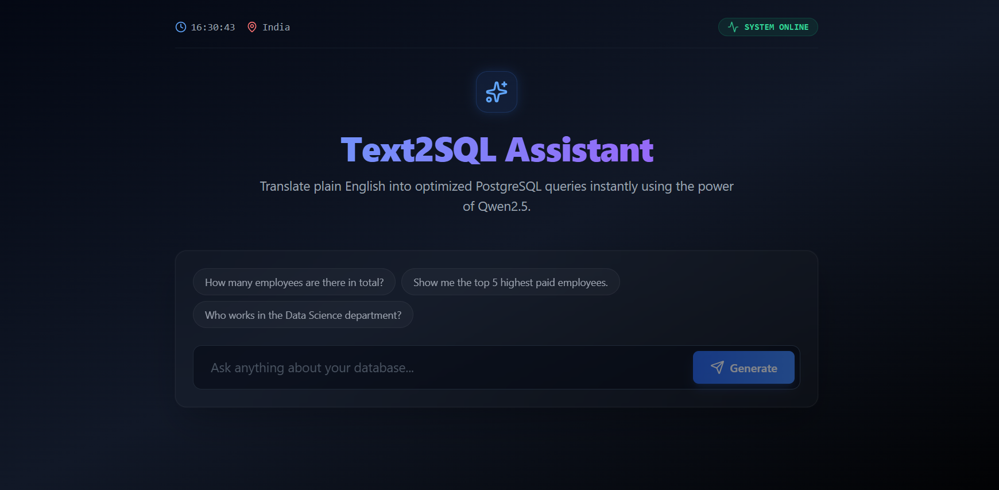

# ⚡ Nexus AI Query: Local LLM Text-to-SQL Assistant


## 📖 Overview
Nexus AI Query is a modern, privacy-first Full-Stack web application that translates natural language questions into highly optimized PostgreSQL queries. Built with a React/Vite frontend and a FastAPI backend, this architecture leverages the local execution of the **Qwen2.5 (1.5B)** large language model via Ollama to query a database in real-time. 

Because the LLM is hosted locally, this architecture guarantees zero data leakage to third-party APIs, making it an enterprise-grade prototype for secure internal tooling.

*(📸 UI Screenshot - )*

## ✨ Key Features
* **Natural Language to SQL:** Instantly generate precise `SELECT`, `COUNT`, and relational queries using everyday English.
* **100% Local AI Execution:** Powered by Ollama and Qwen2.5, ensuring high-speed inference without relying on paid OpenAI/Claude endpoints.
* **Custom Database Seeder:** Includes a Python-based backend automation script to instantly seed the PostgreSQL database with hundreds of realistic, randomized employee records.
* **Modern "Glassmorphism" UI:** Designed with Tailwind CSS and Lucide React, featuring real-time system status indicators, latency tracking, and responsive data tables.
* **Robust Error Handling:** Seamlessly intercepts and handles invalid queries, CORS issues, and database connection dropouts.

## 🏗️ System Architecture
1. **Frontend (React + Vite + TypeScript):** Captures user input and renders real-time system metrics (execution time, active rows).
2. **Backend (FastAPI):** Acts as the high-concurrency bridge. It receives the REST payload, dynamically prompts the LLM with the database schema, and cleans the Markdown output.
3. **AI Engine (Ollama/Qwen2.5):** Processes the schema and question, returning pure SQL syntax.
4. **Database (PostgreSQL 16):** Executes the generated query against the seeded employee tables and returns the raw data payload back up the chain.

## 🚀 Quick Start / Installation

### Prerequisites
* [Node.js](https://nodejs.org/) & npm
* [Python 3.10+](https://www.python.org/)
* [PostgreSQL](https://www.postgresql.org/)
* [Ollama](https://ollama.com/) (with `qwen2.5:1.5b` model pulled)

### 1. Database Setup
1. Open pgAdmin or `psql` and create a database named `postgres`.
2. Create the target table:
```sql
CREATE TABLE employees (
    id SERIAL PRIMARY KEY,
    name VARCHAR(100),
    department VARCHAR(100),
    salary INTEGER
);

### 2. Backend Setup
```bash
cd backend
python -m venv venv
venv\Scripts\activate      # On Windows
pip install fastapi uvicorn psycopg2-binary requests python-dotenv

# Create a .env file and add your database password:
# DB_PASSWORD=your_password

# Run the database seeder to inject 500 records
python seed.py

# Start the FastAPI server
uvicorn main:app --reload

### 3. Frontend Setup
```bash
cd frontend
npm install
npm run dev

